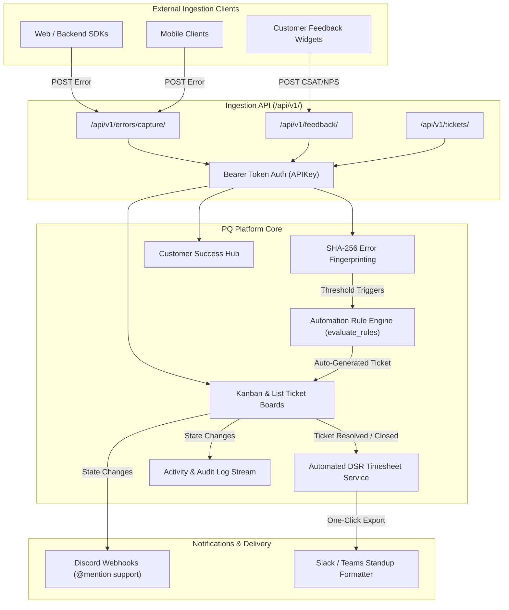

<div align="center">

# ⚡ PQ Platform (Product Quality & Reliability)

### *The Unified Developer Workspace for Error Tracking, Issue Management, Automated DSR Timesheets & Customer Operations.*

[](https://www.djangoproject.com/)
[](https://www.python.org/)
[](https://htmx.org/)
[](https://alpinejs.dev/)
[](https://www.django-rest-framework.org/)
[](https://www.docker.com/)
[](LICENSE)

<br />

**PQ Platform** bridges the chasm between production telemetry, sprint execution, customer feedback, and engineering accountability. Instead of paying for and juggling five disconnected SaaS tools (Sentry, Linear, Toggl, Zendesk, and Zapier), PQ Platform consolidates the entire developer feedback loop into a single, cohesive, blazing-fast workspace.

[Key Features](#-key-features) • [System Architecture](#-system-architecture) • [Quickstart Guide](#-quickstart-guide) • [Demo Personas](#-demo-accounts--personas) • [API Reference](#-ingestion-api-reference) • [Design Philosophy](#-tech-stack--design-philosophy)

</div>

---

## 🌟 Why PQ Platform?

Engineering organizations frequently suffer from **context fragmentation**:
1. **Telemetry is trapped in silos:** Application errors trigger alerts in error monitoring tools that never get triaged into engineering sprint boards.
2. **Timesheets and DSRs are despised:** Engineers waste Friday afternoons manually guessing how many hours they spent on bug fixes, leading to inaccurate Daily Status Reports.
3. **Customer feedback gets lost:** Support tickets in CS tools don't link back to specific products or underlying error occurrences.
4. **Heavyweight frontend drag:** Modern web apps drown in massive `node_modules`, complex Webpack/Vite build matrices, and brittle hydration errors.

**PQ Platform solves this with an integrated, zero-build architecture:**
- 💥 **Automated Incident-to-Ticket Flow:** Errors captured via SDK deduplicate into Error Groups. When error frequency exceeds threshold rules, the platform automatically files prioritized engineering tickets.
- ⏱️ **Zero-Friction DSR Timesheets:** When an engineer resolves a ticket, the platform automatically logs the elapsed duration into their Daily Status Report (DSR) spreadsheet.
- 💬 **Customer Success Operations:** Triage CSAT/NPS survey responses and bug reports directly into backlog items.
- ⚡ **SPA Speed with Zero Build Steps:** Powered by **Django 6 + HTMX + Alpine.js**, delivering instantaneous UI swaps and silky interactions with zero npm dependencies.

---

## 🏗️ System Architecture



---

## ✨ Key Features

### 1. 🎯 Linear-Style Ticket Tracking & Kanban
- **Flexible Views:** Seamless toggle between interactive **Kanban Board** and high-density **List View** with preserved search and filter parameters.
- **Dynamic HTMX Filtering:** Filter instantly by status, priority, assignee, type, and search keyword without full page reloads.
- **Mobile Touch Ready:** Touch fallback allows long-pressing cards on mobile and tablet devices to transition columns effortlessly.
- **Full Lifecycle Support:** Manage tickets from `Backlog` ➔ `Todo` ➔ `In Progress` ➔ `In Review` ➔ `Resolved` ➔ `Closed`.

### 2. ⚡ Telemetry & Error Tracking (Sentry-Alternative)
- **High-Throughput Ingestion:** DRF-powered `/api/v1/errors/capture/` endpoint designed for SDKs.
- **SHA-256 Fingerprinting:** Intelligent clustering of exceptions into distinct `ErrorGroup` records with occurrence counts and timestamps.
- **1-Click Ticket Escalation:** Convert any production error directly into an assigned engineering ticket with attached stack traces.
- **Triage Actions:** Resolve or ignore errors directly from the dashboard or error detail views.

### 3. 📊 Automated DSR (Daily Status Report) & Timesheets
- **Interactive Spreadsheet Grid:** Real-time editable DSR table with inline HTMX cell editing for hours, notes, and task categorizations.
- **Automatic Duration Tracking:** Resolving or closing a ticket automatically calculates active duration and logs a `[AUTO]` DSR entry for assignees.
- **Daily Target Progress:** Dynamic visual progress meter tracking completion toward the standard 8.0-hour daily goal.
- **Manager & Admin Oversight:** Company leadership can view team-wide progress bars, completed task metrics, and inspect individual timesheets.
- **Standup Formatter:** 1-click clipboard button that formats today's logged work into a clean Slack/Teams standup message.

### 4. 💬 CS Hub & Customer Feedback Ingestion
- **CSAT & NPS Collection:** Collect ratings, sentiment, and user comments via API or embeddable survey widgets.
- **Triage to Backlog:** Escalate customer feature requests and reported bugs directly to engineering teams.
- **Product-Scoped Analytics:** Track satisfaction scores across individual product releases.

### 5. 🤖 Auto-Ticket Automation Engine
- **Configurable Rule Engine:** Create custom `AutoTicketRule` triggers (e.g. *If error occurrences exceed 10 hits within 15 minutes, automatically file a Critical Bug*).
- **Background Cron Evaluation:** Run via `python manage.py evaluate_rules [--dry-run]` to continuously safeguard reliability.
- **Deduplication Safeguards:** Tracks execution logs to prevent spamming duplicate tickets for the same error surge.

### 6. 🔔 Discord Webhooks & Team Notifications
- **Real-Time Webhook Dispatch:** Post rich embeds to product-specific Discord channels on ticket creation, status changes, and critical incidents.
- **Native User Mentions:** Maps user profiles to Discord IDs (`<@discord_id>`) for direct attention and notification routing.

### 7. 🛡️ Two-Tier Multi-Tenancy & Access Control
- **Layer 1 (Company Isolation):** Complete tenant partitioning via `Company` and `Membership` roles (`Owner`, `Admin`, `Developer`, `Support`, `Viewer`).
- **Layer 2 (Per-Product RBAC):** Fine-grained `ProductAccess` controls ensuring developers and support agents only see products and tickets they have been explicitly granted.

---

## 🚀 Quickstart Guide

### Prerequisites
- **Python 3.12+**
- **SQLite 3** (Default) or PostgreSQL
- Git

### Local Setup (Virtual Environment)

```bash
# 1. Clone the repository
git clone https://github.com/your-org/product-quality-platform.git
cd product-quality-platform

# 2. Create and activate a Python virtual environment
python3 -m venv venv
source venv/bin/activate  # On Windows use: venv\Scripts\activate

# 3. Install dependencies
pip install -r requirements.txt

# 4. Run database migrations
python manage.py migrate

# 5. Populate workspace with demo data (Acme Corp)
python manage.py seed_data

# 6. Start the development server
python manage.py runserver 8010
```

Visit **[http://localhost:8010](http://localhost:8010)** in your browser.

---

## 🐳 Docker Setup

Run the entire application in a container with persistent SQLite storage:

```bash
# Build and run with Docker Compose
docker-compose up --build
```

The application will be accessible at **[http://localhost:8011](http://localhost:8011)**.

---

## 👥 Demo Accounts & Personas

The `seed_data` management command wipes and initializes a complete demo workspace (**Acme Corp**) with 3 active products (*Checkout API*, *Mobile App*, *Billing Portal*), error logs, tickets, surveys, and timesheets.

All demo accounts share the password: `testpass123`

| Username | Role | Permissions & Recommended Testing Flow |
| :--- | :--- | :--- |
| **`owner`** | **Owner** | Full workspace access. Can invite members, view company-wide audit logs, manage company settings, and oversee all DSR timesheets. |
| **`admin`** | **Admin** | Manages products, automations, API keys, team memberships, and team DSR summaries. |
| **`dev1`** | **Developer** | Assigned to Checkout API and Mobile App. Tests Kanban boards, moves tickets to Resolved (triggers auto-DSR), and edits DSR sheets. |
| **`dev2`** | **Developer** | Assigned to Mobile App and Billing Portal. Test product isolation boundaries. |
| **`support`**| **Support** | Triages CS Hub feedback, converts customer complaints into tickets, tests support workflows. |
| **`viewer`** | **Viewer** | Read-only stakeholder view for executives and external auditors. |

---

## 🔌 Ingestion API Reference

External services, backend workers, and client applications authenticate using product-scoped API keys passed in the `Authorization` header:

```http
Authorization: Bearer <YOUR_PRODUCT_API_KEY>
```

### 1. Ingest Error Occurrence
Capture unhandled exceptions and runtime errors from your backend or frontend apps.

```bash
curl -X POST http://localhost:8010/api/v1/errors/capture/ \
  -H "Authorization: Bearer <API_KEY>" \
  -H "Content-Type: application/json" \
  -d '{
    "message": "PaymentIntent requires_payment_method: Customer card was declined",
    "error_type": "StripePaymentError",
    "severity": "critical",
    "stack_trace": "File \"/app/services/billing.py\", line 142, in process_charge\n  raise StripePaymentError(\"Card declined\")",
    "culprit": "services/billing.py:142",
    "environment": "production",
    "release": "1.4.0",
    "metadata": {
      "user_id": "usr_9912",
      "cart_total": 84.50
    }
  }'
```

### 2. Submit Customer Feedback / Survey
Ingest CSAT ratings, NPS responses, or bug reports directly into the CS Hub.

```bash
curl -X POST http://localhost:8010/api/v1/feedback/ \
  -H "Authorization: Bearer <API_KEY>" \
  -H "Content-Type: application/json" \
  -d '{
    "customer_email": "jane.doe@example.com",
    "rating": 2,
    "category": "bug",
    "comment": "The checkout page gave me an error after entering my billing address."
  }'
```

### 3. Create a Ticket Programmatically
Create a tracked engineering issue from third-party systems (e.g. CI/CD pipelines, monitoring alerts).

```bash
curl -X POST http://localhost:8010/api/v1/tickets/ \
  -H "Authorization: Bearer <API_KEY>" \
  -H "Content-Type: application/json" \
  -d '{
    "title": "Database connection pool exhausted during nightly sync",
    "ticket_type": "bug",
    "priority": "high",
    "description": "Connection pool reached maximum threshold of 50 connections."
  }'
```

### 4. Update Ticket Status
Update progress or close out tickets from automated deployment pipelines.

```bash
curl -X PATCH http://localhost:8010/api/v1/tickets/42/status/ \
  -H "Authorization: Bearer <API_KEY>" \
  -H "Content-Type: application/json" \
  -d '{
    "status": "resolved"
  }'
```

---

## ⚙️ Management Commands

### `evaluate_rules`
Evaluates configured threshold rules against recent `ErrorGroup` frequency to automatically file tickets. Designed to be run periodically via cron (e.g. every 5 minutes):

```bash
# Execute evaluation and create tickets
python manage.py evaluate_rules

# Dry-run mode: prints evaluations without modifying data
python manage.py evaluate_rules --dry-run
```

### `seed_data`
Resets the database and populates high-fidelity sample data across all entities:

```bash
python manage.py seed_data
```

---

## 🎨 Tech Stack & Design Philosophy

| Layer | Technology | Rationale |
| :--- | :--- | :--- |
| **Backend Framework** | **Django 6.0** | Robust ORM, built-in security protections, enterprise authentication, and bulletproof relational data modeling. |
| **Dynamic Frontend** | **HTMX 2.x** | Enables full SPA capabilities (live search, modal drawers, in-place table updates) while writing simple, readable Django HTML templates. |
| **Client Reactivity** | **Alpine.js 3.x** | Lightweight micro-reactivity for dropdowns, modals, and local component states without a JavaScript framework bundle. |
| **Styling & Design** | **Modern CSS Tokens** | Zero CSS framework lock-in. Built entirely with clean CSS custom properties (`--panel`, `--border`, `--accent`) providing consistent contrast, typography, and dark/light adaptability. |
| **API Layer** | **Django REST Framework** | Token-authenticated ingestion endpoints with throttling, validation, and JSON schemas. |
| **Database** | **SQLite / PostgreSQL** | Zero-config SQLite out of the box with total migration compatibility for production PostgreSQL. |

> ### 💡 Why No Node / Webpack / React?
> We believe modern developer platforms spend too much compute and operational overhead on frontend build pipelines. By leveraging **Django 6 + HTMX + Alpine.js**, this codebase achieves **instant cold-starts, sub-30ms response times, zero asset compilation steps, and trivial deployments**.

---

## 📁 Repository Structure

```text
product-quality-platform/
├── apps/
│   ├── accounts/       # User model, multi-tenant Company, Membership, & Auth views
│   ├── automation/     # Auto-ticket threshold rules & cron evaluation engine
│   ├── core/           # Middleware, tenant-scoped base models, context processors
│   ├── dashboards/     # Executive stats, needs-attention list, activity audit log
│   ├── dsr/            # Daily Status Report spreadsheet, auto-logger, & standup export
│   ├── errors/         # Error groups, occurrences, stack traces, & triage views
│   ├── feedback/       # Customer Success Hub, CSAT / NPS surveys, & feedback ingestion
│   ├── ingestion/      # Public API (/api/v1/) with per-product APIKey authentication
│   ├── products/       # Product management, versioning, Discord webhooks, & RBAC access
│   └── tickets/        # Kanban board, list view, ticket lifecycle, comments, & assignments
├── core/
│   ├── settings.py     # Global Django configuration & security parameters
│   ├── urls.py         # Root URL routing table
│   └── wsgi.py         # Production WSGI application gateway
├── templates/          # Server-rendered HTML templates & modular HTMX partials
├── docker-compose.yml  # Local container orchestration
├── Dockerfile          # Multi-stage production container image
├── entrypoint.sh       # Container migration & startup script
└── requirements.txt    # Python package dependencies
```

---

## 🧪 Testing & Verification

Run the test suite using Django's test runner:

```bash
# Run tests across all platform applications
python manage.py test apps

# Run tests for a specific module (e.g. Tickets access control)
python manage.py test apps.tickets

# Run tests for ingestion API
python manage.py test apps.ingestion
```

---

## 📄 License

This project is licensed under the **MIT License**. Feel free to use, modify, and distribute it in your own software.
